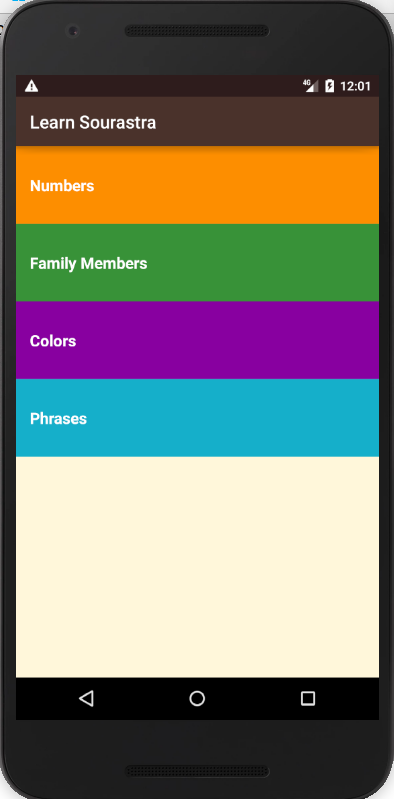
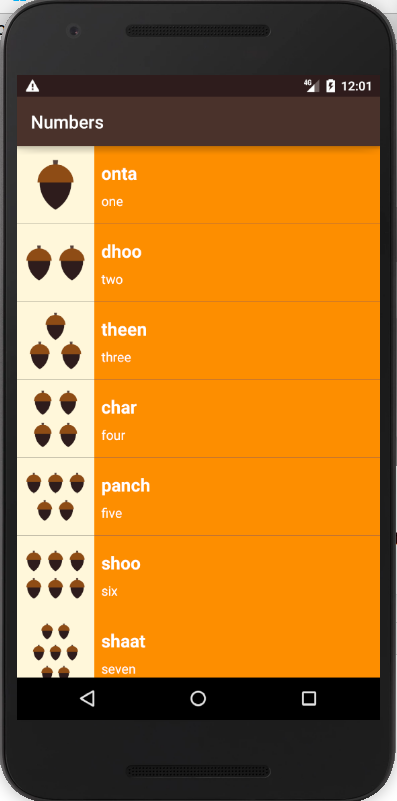
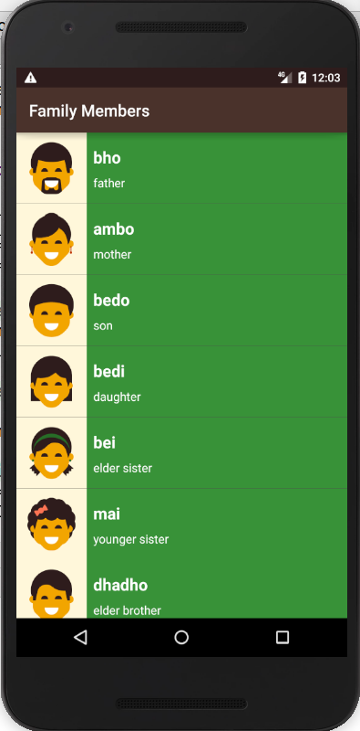

Sourastra App
===================================

This app displays lists of vocabulary words for the user to learn the Sourastra language. It helps to pronunciate basic words in the language.

Pre-requisites
--------------

- Android SDK v23
- Android Build Tools v23.0.2
- Android Support Repository v23.3.0

Getting Started
---------------

This sample uses the Gradle build system. To build this project, use the
"gradlew build" command or use "Import Project" in Android Studio.

Screenshots
-----------
Here are some screenshots of the application.

 

